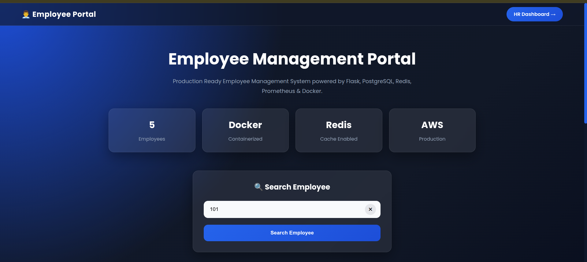
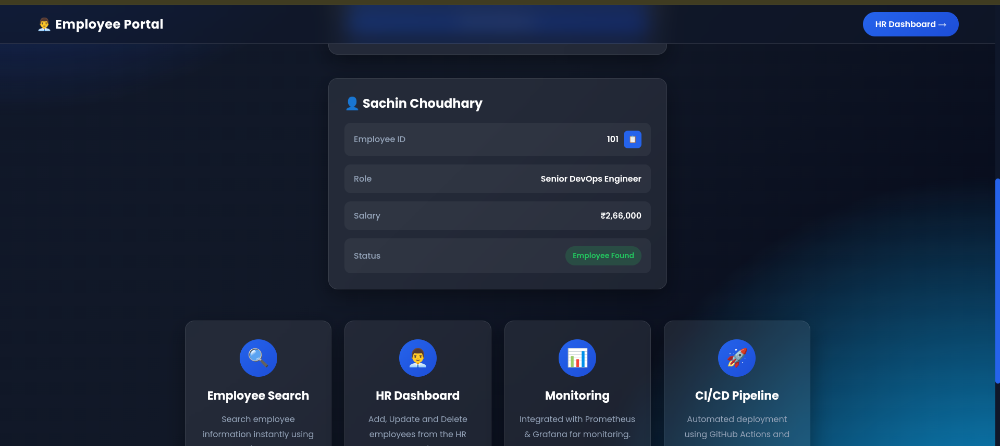
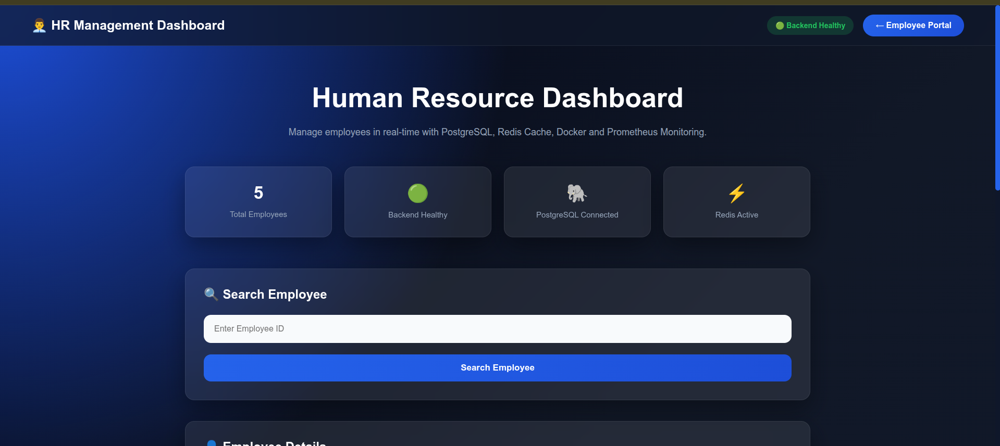
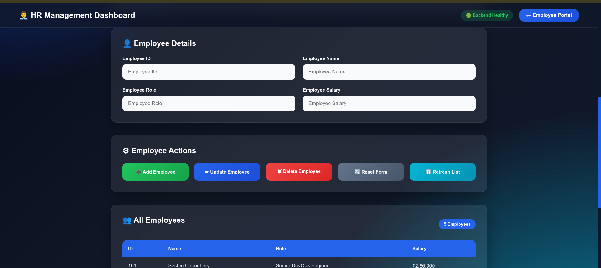
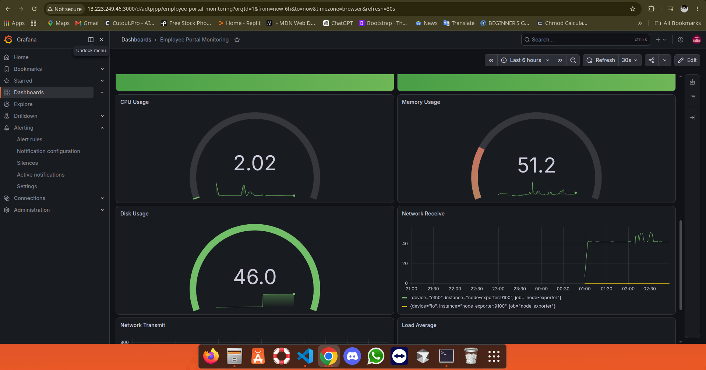
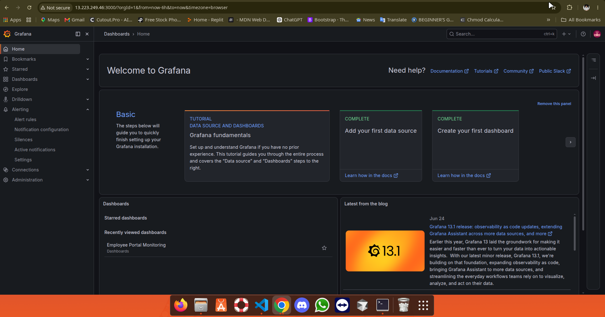
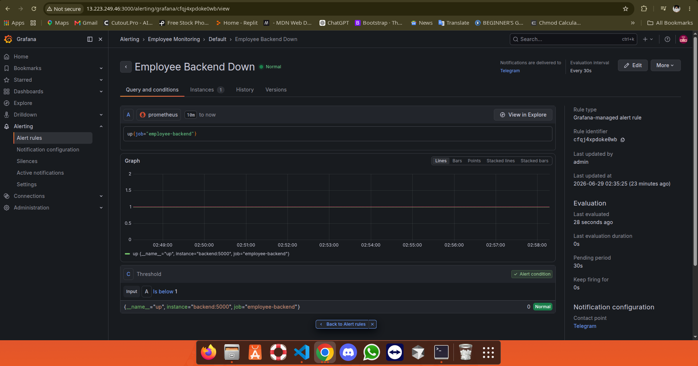
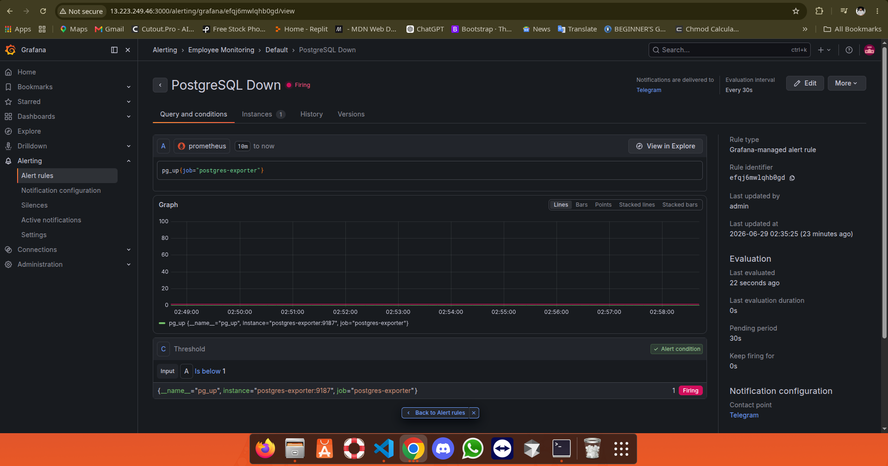
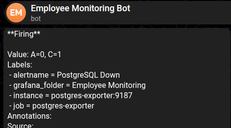
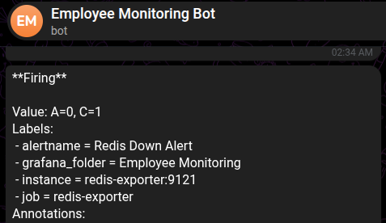

# 🚀 Employee Portal DevOps Project

<p align="center">


</p>

---

# 📌 Project Overview

Employee Portal DevOps Project is a **production-ready employee management system** developed using modern DevOps practices.

The application allows users to search employee records, while administrators can securely manage employee information through a dedicated HR Dashboard.

The project demonstrates the complete software deployment lifecycle including:

- Modern Frontend Development
- REST API Development
- PostgreSQL Database Integration
- Redis Caching
- Docker Containerization
- Docker Compose Orchestration
- Prometheus Monitoring
- Grafana Dashboards
- Telegram Alerting
- AWS EC2 Deployment
- CloudFront CDN
- GitHub Actions CI/CD Pipeline

This project was built to simulate a real-world production environment and showcase practical DevOps skills.

---

#  Project Features

## 👨 Employee Portal

- Search Employee by Employee ID
- Responsive Modern UI
- Loading Animation
- Toast Notifications
- Search Reset Button
- Keyboard Search (Enter Key)
- Employee Information Card
- Responsive Design

---

## 👨‍💼 HR Dashboard

- Search Employee
- Add Employee
- Update Employee
- Delete Employee
- Employee Statistics
- Backend Health Status
- PostgreSQL Status
- Redis Status
- Loading Overlay
- Responsive Admin Dashboard

---

##  Backend Features

- RESTful Flask API
- SQLAlchemy ORM
- PostgreSQL Database
- Redis Cache
- Cache Invalidation
- Health Check Endpoint
- Prometheus Metrics
- Error Handling
- Production Ready Structure

---

##  Monitoring Features

- Prometheus Monitoring
- Grafana Dashboards
- Redis Exporter
- PostgreSQL Exporter
- Node Exporter
- Alert Rules
- Telegram Notifications

---

## ☁ Cloud Infrastructure

- AWS EC2
- AWS CloudFront
- Docker Compose
- GitHub Actions CI/CD
- Automated Deployment
- Production Ready Architecture

---

# 🛠 Technology Stack

| Category | Technologies |
|-----------|--------------|
| Frontend | HTML5, CSS3, JavaScript |
| Backend | Python, Flask |
| Database | PostgreSQL |
| Cache | Redis |
| ORM | SQLAlchemy |
| Monitoring | Prometheus, Grafana |
| Exporters | Node Exporter, Redis Exporter, PostgreSQL Exporter |
| Containerization | Docker, Docker Compose |
| Cloud | AWS EC2, AWS CloudFront |
| Automation | GitHub Actions |
| Version Control | Git & GitHub |

---

# 🌐 Live Demo

## Employee Portal

https://djrsvxg7njjaz.cloudfront.net

---

## HR Dashboard

https://djrsvxg7njjaz.cloudfront.net/hr_dashboard.html

---

## Backend Health

https://djrsvxg7njjaz.cloudfront.net/health

---

## Prometheus Metrics

https://djrsvxg7njjaz.cloudfront.net/metrics

---

# 🏗 System Architecture

The Employee Portal follows a production-style cloud architecture where the frontend and backend are separated for better scalability, security and performance.

```text
                           ┌───────────────────────────┐
                           │           User            │
                           │     Browser / Client      │
                           └─────────────┬─────────────┘
                                         │
                                         ▼
                         ┌────────────────────────────────┐
                         │         AWS CloudFront         │
                         │            CDN Layer           │
                         └─────────────┬──────────────────┘
                                       │
                 ┌─────────────────────┴─────────────────────┐
                 │                                           │
                 ▼                                           ▼
      ┌───────────────────────┐                 ┌────────────────────────┐
      │     Amazon S3         │                 │     Flask Backend      │
      │   Static Frontend     │                 │      Running on EC2    │
      │                       │                 │                        │
      │ index.html            │                 │ REST API              │
      │ hr_dashboard.html     │                 │ /employee             │
      │ CSS / JavaScript      │                 │ /employees            │
      └───────────────────────┘                 │ /health               │
                                                │ /metrics              │
                                                └───────────┬───────────┘
                                                            │
                                   ┌────────────────────────┼──────────────────────┐
                                   ▼                        ▼                      ▼
                         ┌──────────────────┐      ┌────────────────┐     ┌─────────────────┐
                         │   PostgreSQL     │      │     Redis      │     │ Prometheus      │
                         │ Employee Data    │      │ Cache Layer    │     │ Metrics         │
                         └──────────────────┘      └────────────────┘     └─────────┬───────┘
                                                                                     │
                                                                                     ▼
                                                                           ┌─────────────────┐
                                                                           │    Grafana      │
                                                                           │ Dashboards      │
                                                                           └─────────┬───────┘
                                                                                     │
                                                                                     ▼
                                                                           ┌─────────────────┐
                                                                           │ Alertmanager    │
                                                                           │ Telegram Alerts │
                                                                           └─────────────────┘
```

---

# ☁ AWS Infrastructure

The application is deployed on Amazon Web Services using a production-style architecture.

### Infrastructure Components

- Amazon EC2 for backend application hosting
- Amazon S3 for static frontend hosting
- AWS CloudFront CDN for global content delivery
- Docker Compose for multi-container deployment
- GitHub Actions for Continuous Integration and Deployment

---

# 🐳 Docker Architecture

The complete application is containerized using Docker Compose.

## Running Containers

- Backend (Flask + Gunicorn)
- PostgreSQL Database
- Redis Cache
- Prometheus
- Grafana
- Redis Exporter
- PostgreSQL Exporter
- Node Exporter

Each service runs inside its own isolated Docker container and communicates over the Docker network.

---

# 📂 Project Structure

```text
employee-portal-devops
│
├── backend
│   ├── app.py
│   ├── config.py
│   ├── models.py
│   ├── requirements.txt
│   ├── Dockerfile
│   └── scripts
│
├── frontend
│   ├── index.html
│   ├── style.css
│   ├── app.js
│   ├── hr_dashboard.html
│   ├── hr_dashboard.css
│   └── hr_dashboard.js
│
├── monitoring
│   ├── prometheus.yml
│   ├── alert_rules.yml
│   └── grafana
│
├── screenshots
│   ├── Employee Portal
│   ├── HR Dashboard
│   ├── Grafana
│   ├── Prometheus
│   └── Telegram Alerts
│
├── docker-compose.yml
├── README.md
└── .github
    └── workflows
```

---

#  Request Flow

1. User opens the Employee Portal through CloudFront.
2. CloudFront serves static frontend files from Amazon S3.
3. API requests are forwarded to the Flask backend running on EC2.
4. The backend checks Redis for cached data.
5. On a cache miss, data is retrieved from PostgreSQL.
6. The response is cached in Redis for faster future requests.
7. Prometheus continuously collects metrics from the backend and exporters.
8. Grafana visualizes system health and performance.
9. Alertmanager sends Telegram notifications when configured alert rules are triggered.

---

#  Production Highlights

- Containerized Microservice Architecture
- Redis-based API Caching
- PostgreSQL Persistent Storage
- CloudFront CDN Integration
- Automated Health Monitoring
- Real-time Metrics Collection
- Telegram Alert Notifications
- GitHub Actions CI/CD Pipeline
- Production-ready Deployment

# Installation Guide

Follow the steps below to run the Employee Portal DevOps Project locally.

---

#  Prerequisites

Before starting, make sure the following software is installed.

- Git
- Docker
- Docker Compose
- Python 3.12+
- PostgreSQL (Optional for local development)
- Redis (Optional for local development)

Verify installation:

```bash
git --version

docker --version

docker compose version

python3 --version
```

---

#  Clone Repository

```bash
git clone https://github.com/<YOUR_USERNAME>/employee-portal-devops.git

cd employee-portal-devops
```

---

# 📂 Project Structure

```bash
employee-portal-devops/
```

---

# 🐳 Build Docker Images

```bash
docker compose build
```

---

#  Start All Containers

```bash
docker compose up -d
```

Check running containers

```bash
docker compose ps
```

---

# 🛑 Stop Containers

```bash
docker compose stop
```

---

# 🔄 Restart Containers

```bash
docker compose restart
```

---

# ❌ Remove Containers

```bash
docker compose down
```

---

#  Remove Containers + Volumes

```bash
docker compose down -v
```

---

#  View Logs

Backend

```bash
docker compose logs backend
```

Live Logs

```bash
docker compose logs -f backend
```

All Containers

```bash
docker compose logs
```

---

# 🌐 Access Application

## Employee Portal

```
http://localhost
```

or

```
https://djrsvxg7njjaz.cloudfront.net
```

---

## HR Dashboard

```
http://localhost/hr_dashboard.html
```

or

```
https://djrsvxg7njjaz.cloudfront.net/hr_dashboard.html
```

---

## Backend API

```
http://localhost:5001
```

---

## Health Endpoint

```
http://localhost:5001/health
```

---

## Metrics Endpoint

```
http://localhost:5001/metrics
```

---

#  Environment Variables

Example configuration

```env
POSTGRES_DB=employee_db

POSTGRES_USER=postgres

POSTGRES_PASSWORD=postgres

POSTGRES_HOST=postgres

POSTGRES_PORT=5432

REDIS_HOST=redis

REDIS_PORT=6379

FLASK_ENV=production
```

---

#  Docker Services

The application consists of the following containers.

| Container | Purpose |
|------------|---------|
| backend | Flask REST API |
| postgres | PostgreSQL Database |
| redis | Redis Cache |
| prometheus | Metrics Collection |
| grafana | Monitoring Dashboard |
| redis-exporter | Redis Metrics |
| postgres-exporter | PostgreSQL Metrics |
| node-exporter | EC2 Metrics |

---

# 🔌 REST API Endpoints

## Home

```http
GET /
```

Returns application status.

---

## Health Check

```http
GET /health
```

Checks PostgreSQL and Redis connectivity.

---

## Prometheus Metrics

```http
GET /metrics
```

Returns Prometheus metrics.

---

## Get Employee

```http
GET /employee?id=101
```

---

## Get All Employees

```http
GET /employees
```

---

## Add Employee

```http
POST /employee
```

Request

```json
{
  "id": 106,
  "name": "John",
  "role": "DevOps Engineer",
  "salary": "₹1,20,000"
}
```

---

## Update Employee

```http
PUT /employee/106
```

Request

```json
{
  "name": "John Doe",
  "role": "Senior DevOps Engineer",
  "salary": "₹1,50,000"
}
```

---

## Delete Employee

```http
DELETE /employee/106
```

---

#  Verify Backend

Health Check

```bash
curl http://localhost:5001/health
```

Employee List

```bash
curl http://localhost:5001/employees
```

Metrics

```bash
curl http://localhost:5001/metrics
```

---

# 📊 Verify Monitoring

Prometheus

```
http://localhost:9090
```

Grafana

```
http://localhost:3000
```

Node Exporter

```
http://localhost:9100
```

Redis Exporter

```
http://localhost:9121
```

PostgreSQL Exporter

```
http://localhost:9187
```

---

#  Basic Functional Testing

- ✅ Search employee by ID
- ✅ Add a new employee
- ✅ Update employee details
- ✅ Delete employee
- ✅ Verify Redis cache hit/miss
- ✅ Verify Prometheus metrics
- ✅ Verify Grafana dashboards
- ✅ Verify backend health endpoint

#  Monitoring & Observability

A complete monitoring stack has been integrated into the project to provide real-time visibility into application performance, infrastructure health and system resources.

The monitoring solution is powered by **Prometheus**, **Grafana**, multiple **Exporters**, and **Alertmanager** with **Telegram notifications**.

---

#  Monitoring Stack

| Component | Purpose |
|-----------|---------|
| Prometheus | Metrics Collection |
| Grafana | Dashboard Visualization |
| Alertmanager | Alert Processing |
| Telegram | Alert Notifications |
| Node Exporter | EC2 System Metrics |
| PostgreSQL Exporter | Database Metrics |
| Redis Exporter | Redis Metrics |

---

#  Grafana Dashboards

The project contains multiple Grafana dashboards to monitor different parts of the infrastructure.

## Dashboard Overview

- Employee Portal Performance
- Backend API Health
- PostgreSQL Metrics
- Redis Metrics
- CPU Usage
- Memory Usage
- Disk Usage
- Network Traffic
- Container Status

---

#  Backend Metrics

Custom Prometheus metrics are exposed through:

```
GET /metrics
```

The following metrics are collected.

## Employee API Metrics

```
employee_requests_total
```

Total employee search requests.

---

```
employee_request_duration_seconds
```

Measures API response time.

---

```
employee_created_total
```

Total employees created.

---

```
employee_updated_total
```

Total employee updates.

---

```
employee_deleted_total
```

Total deleted employees.

---

#  Redis Metrics

```
employee_cache_hits_total
```

Number of successful Redis cache hits.

---

```
employee_cache_miss_total
```

Number of Redis cache misses.

---

```
employee_list_cache_hits_total
```

Employee list cache hits.

---

```
employee_list_cache_miss_total
```

Employee list cache misses.

---

#  Employee List Metrics

```
employee_list_requests_total
```

Tracks total employee list requests.

---

#  PostgreSQL Monitoring

PostgreSQL Exporter collects metrics such as

- Database Connections
- Transactions
- Query Statistics
- Database Size
- Locks
- Cache Usage
- Active Sessions

---

#  Redis Monitoring

Redis Exporter monitors

- Connected Clients
- Memory Usage
- Cache Hits
- Cache Misses
- Commands Processed
- Keys Stored
- Redis Uptime

---

# 🖥 Node Exporter Metrics

Node Exporter provides

- CPU Usage
- Memory Usage
- Disk Space
- Disk I/O
- Network Traffic
- System Load
- Filesystem Usage
- Host Uptime

---

#  Alerting System

The project includes automated alerting using Alertmanager.

Alerts are triggered when predefined thresholds are crossed.

Current alert rules include

- Backend Down
- PostgreSQL Down
- Redis Down
- High CPU Usage
- High Memory Usage

---

#  Telegram Notifications

Whenever an alert is triggered, Alertmanager automatically sends a Telegram notification.

Example alerts

- Backend Down
- PostgreSQL Down
- Redis Down
- High CPU Usage
- High Memory Usage

This enables real-time monitoring without continuously watching the Grafana dashboard.

---

#  Health Endpoint

The backend exposes a production-ready health endpoint.

```
GET /health
```

The endpoint verifies

- Flask Backend
- PostgreSQL Connection
- Redis Connectivity

Example Response

```json
{
  "status":"healthy",
  "database":"connected",
  "redis":"connected",
  "service":"employee-backend"
}
```

---

#  Prometheus Targets

Prometheus continuously scrapes metrics from

- Flask Backend
- Node Exporter
- PostgreSQL Exporter
- Redis Exporter

All configured targets remain visible from the Prometheus Targets page.

---

#  Monitoring Workflow

```
Flask Backend
       │
       ▼
Prometheus Scrapes Metrics
       │
       ▼
Grafana Dashboards
       │
       ▼
Alert Rules
       │
       ▼
Alertmanager
       │
       ▼
Telegram Notification
```

---

#  Monitoring Highlights

- Production-ready Monitoring Stack
- Custom Flask Metrics
- PostgreSQL Monitoring
- Redis Monitoring
- EC2 Infrastructure Monitoring
- Real-time Dashboards
- Automated Alert Rules
- Telegram Notifications
- Health Endpoint
- Performance Metrics
- API Latency Monitoring
- Cache Performance Monitoring

# 📸 Project Screenshots

The following screenshots demonstrate different components of the Employee Portal DevOps Project.

---

# 👨 Employee Portal

Modern employee search interface with responsive UI, toast notifications and loading animations.

## Dashboard

<p align="center">



</p>

---

## Employee Search

<p align="center">



</p>

---

# 👨‍💼 HR Dashboard

Production-ready administrator dashboard for managing employee records.

Features include:

- Search Employee
- Add Employee
- Update Employee
- Delete Employee
- Backend Health Status
- Employee Statistics
- Responsive Design

---

## HR Dashboard

<p align="center">



</p>

---

## Employee Management

<p align="center">



</p>

---

#  System Monitoring

Real-time infrastructure monitoring using Prometheus and Grafana.

---

## Monitoring Dashboard

<p align="center">


</p>

---

## Infrastructure Dashboard

<p align="center">



</p>

---

#  Grafana Dashboard

Complete visualization of infrastructure, backend, Redis and PostgreSQL metrics.

<p align="center">



</p>

---

#  Prometheus Targets

Prometheus continuously scrapes metrics from all configured services.

<p align="center">


</p>

---

#  Alert Rules

The project includes production-ready alert rules for multiple services.

---

## Backend Down Alert

<p align="center">



</p>

---

## PostgreSQL Down Alert

<p align="center">



</p>

---

## High Memory Alert

<p align="center">


</p>

---

## Redis Down Alert

<p align="center">


</p>

---

## High CPU Alert

<p align="center">


</p>

---

#  Telegram Alert Notifications

Alertmanager automatically sends Telegram notifications whenever alert conditions are met.

---

## High CPU Notification

<p align="center">


</p>

---

## High Memory Notification

<p align="center">


</p>

---

## PostgreSQL Down Notification

<p align="center">



</p>

---

## Redis Down Notification

<p align="center">



</p>

---

#  Complete Monitoring Workflow

```text
Application

        │

        ▼

Flask Backend

        │

        ▼

Prometheus

        │

        ▼

Grafana Dashboard

        │

        ▼

Alert Rules

        │

        ▼

Alertmanager

        │

        ▼

Telegram Notifications
```

---

# 📌 Key Highlights

- Modern Employee Portal
- Professional HR Dashboard
- Redis Caching
- PostgreSQL Database
- Dockerized Architecture
- AWS EC2 Deployment
- CloudFront CDN
- Prometheus Monitoring
- Grafana Dashboards
- Telegram Alerting
- Production Ready Infrastructure
- Fully Responsive UI

#  Deployment & CI/CD

The project is deployed using a modern DevOps workflow with Docker, AWS, CloudFront and GitHub Actions.

The deployment pipeline automates code integration while keeping the application containerized and production-ready.

---

# 🔄 CI/CD Pipeline

The project uses **GitHub Actions** to automate the deployment workflow.

## Workflow

```text
Developer
      │
      ▼
Git Commit
      │
      ▼
GitHub Repository
      │
      ▼
GitHub Actions
      │
      ▼
Build Docker Images
      │
      ▼
Run Validation Checks
      │
      ▼
Deploy to AWS EC2
      │
      ▼
Application Running
```

---

# ⚙ GitHub Actions

GitHub Actions automatically performs:

- Source Code Checkout
- Docker Image Build
- Docker Compose Validation
- Container Deployment
- Health Verification
- Production Deployment

---

# 🐳 Docker Deployment

The complete application is deployed using Docker Compose.

Containers included in the deployment

- Backend (Flask + Gunicorn)
- PostgreSQL
- Redis
- Prometheus
- Grafana
- Redis Exporter
- PostgreSQL Exporter
- Node Exporter

Docker Compose enables all services to communicate over a dedicated Docker network.

---

# ☁ AWS Deployment

The application is hosted on Amazon Web Services.

Infrastructure includes

- Amazon EC2
- Amazon S3
- AWS CloudFront

CloudFront delivers static frontend assets globally while forwarding API requests to the backend.

---

# 🌐 Deployment Architecture

```text
                User
                  │
                  ▼
        AWS CloudFront CDN
          │             │
          ▼             ▼
   Amazon S3        AWS EC2
  Static Frontend   Flask Backend
                        │
          ┌─────────────┴─────────────┐
          ▼                           ▼
   PostgreSQL Database          Redis Cache
```

---

#  Production Features

The deployment includes several production-ready practices.

- Dockerized Services
- Health Check Endpoint
- Redis Caching
- API Performance Metrics
- CloudFront CDN
- Monitoring Stack
- Automated Alerting
- Container Isolation
- Service Discovery using Docker Network

---

#  Performance Optimizations

The application has been optimized for better performance.

## Redis Caching

Frequently accessed employee records are cached for faster retrieval.

Benefits

- Reduced Database Queries
- Faster API Responses
- Lower Server Load
- Better Scalability

---

## CloudFront CDN

Static frontend assets are delivered through AWS CloudFront.

Benefits

- Faster Page Loading
- Lower Latency
- Global Content Delivery
- Improved User Experience

---

## Docker

Containerization provides

- Consistent Environment
- Easy Deployment
- Service Isolation
- Better Scalability

---

#  Reliability Features

The application includes multiple mechanisms to improve reliability.

- Health Check Endpoint
- Prometheus Metrics
- Grafana Dashboards
- Alert Rules
- Telegram Notifications
- Redis Cache Invalidation

---

#  Testing Checklist

The following functionality has been verified.

## Frontend

- Employee Search
- Responsive Design
- Loading Animation
- Toast Notifications
- HR Dashboard
- CRUD Operations

---

## Backend

- Employee Search API
- Employee List API
- Add Employee API
- Update Employee API
- Delete Employee API
- Health Endpoint
- Metrics Endpoint

---

## Monitoring

- Prometheus Targets
- Grafana Dashboards
- Redis Metrics
- PostgreSQL Metrics
- Node Metrics
- Alert Rules
- Telegram Alerts

---

## Infrastructure

- Docker Containers
- Docker Compose
- AWS EC2
- AWS CloudFront
- GitHub Actions

---

#  Project Highlights

✔ Production-ready Employee Management System

✔ RESTful Flask API

✔ PostgreSQL Database

✔ Redis Caching

✔ Docker Containerization

✔ Docker Compose Orchestration

✔ Prometheus Monitoring

✔ Grafana Dashboards

✔ Telegram Alerting

✔ AWS EC2 Deployment

✔ CloudFront CDN

✔ GitHub Actions CI/CD

✔ Responsive Employee Portal

✔ Modern HR Dashboard

✔ Real-time Monitoring

✔ Health Check Endpoint

✔ Custom Prometheus Metrics

✔ Enterprise-inspired Architecture

#  Skills Demonstrated

This project demonstrates practical implementation of multiple Software Development and DevOps concepts.

## Backend Development

- REST API Development
- Flask Framework
- SQLAlchemy ORM
- CRUD Operations
- Error Handling
- Health Check APIs
- Prometheus Metrics Integration

---

## Database

- PostgreSQL
- Database Design
- SQL Queries
- Database Connectivity
- Persistent Storage

---

## Caching

- Redis
- Cache Hit / Miss
- Cache Invalidation
- Performance Optimization

---

## Frontend Development

- HTML5
- CSS3
- JavaScript (ES6)
- Responsive Design
- Modern UI/UX
- Toast Notifications
- Loading Animations

---

## DevOps

- Docker
- Docker Compose
- AWS EC2
- AWS CloudFront
- GitHub Actions
- CI/CD Pipeline

---

## Monitoring & Observability

- Prometheus
- Grafana
- Alertmanager
- Telegram Alerts
- Node Exporter
- Redis Exporter
- PostgreSQL Exporter

---

# 📚 Learning Outcomes

This project helped me gain practical experience in:

- Building production-ready REST APIs
- Designing scalable application architecture
- Implementing Redis caching strategies
- Monitoring applications using Prometheus & Grafana
- Deploying containerized applications with Docker
- Automating deployments using GitHub Actions
- Managing cloud infrastructure on AWS
- Implementing health checks and observability
- Designing responsive user interfaces
- Understanding real-world DevOps workflows

---

#  Future Improvements

Planned enhancements include:

- JWT Authentication
- Role-Based Access Control (RBAC)
- Employee Profile Photos
- File Upload Support
- Pagination
- Search by Name and Role
- Export Employee Data (CSV / Excel)
- Audit Logs
- Email Notifications
- Kubernetes Deployment
- Terraform Infrastructure
- HTTPS with Custom Domain
- Grafana Alert Enhancements

---

# 📈 Project Summary

| Category | Status |
|----------|--------|
| Employee Portal | ✅ Completed |
| HR Dashboard | ✅ Completed |
| Flask REST API | ✅ Completed |
| PostgreSQL | ✅ Completed |
| Redis Cache | ✅ Completed |
| Docker | ✅ Completed |
| Docker Compose | ✅ Completed |
| AWS EC2 | ✅ Completed |
| CloudFront | ✅ Completed |
| GitHub Actions | ✅ Completed |
| Prometheus | ✅ Completed |
| Grafana | ✅ Completed |
| Telegram Alerts | ✅ Completed |
| Responsive UI | ✅ Completed |
| Health Monitoring | ✅ Completed |

---

# 👨‍💻 Author

**Sachin Choudhary**

Computer Science Engineering (Artificial Intelligence)

Passionate about:

- DevOps
- Cloud Computing
- Backend Development
- Python
- Docker
- AWS
- Monitoring & Observability

---

#  Contributing

Contributions, suggestions and improvements are welcome.

If you find any issues or have ideas for improvement, feel free to open an issue or submit a pull request.

---

# 📄 License

This project is licensed under the **MIT License**.

You are free to use, modify and distribute this project according to the terms of the license.

---

---

#  Acknowledgements

Special thanks to the open-source community and the creators of:

- Flask
- PostgreSQL
- Redis
- Docker
- Prometheus
- Grafana
- GitHub Actions
- AWS

for providing amazing tools that made this project possible.

---

