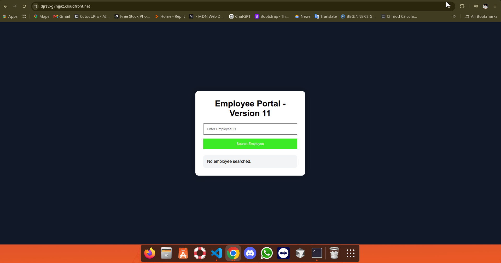
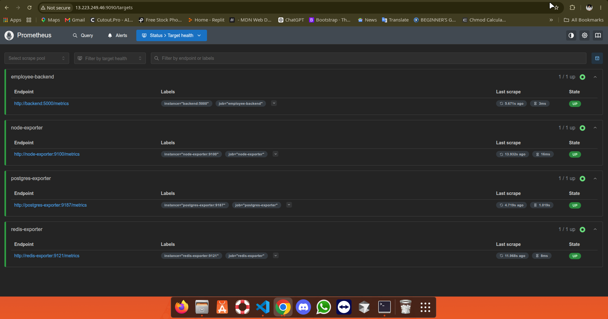
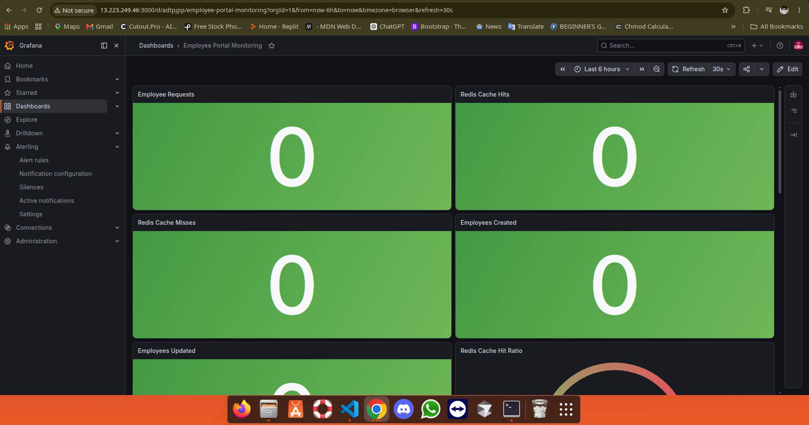
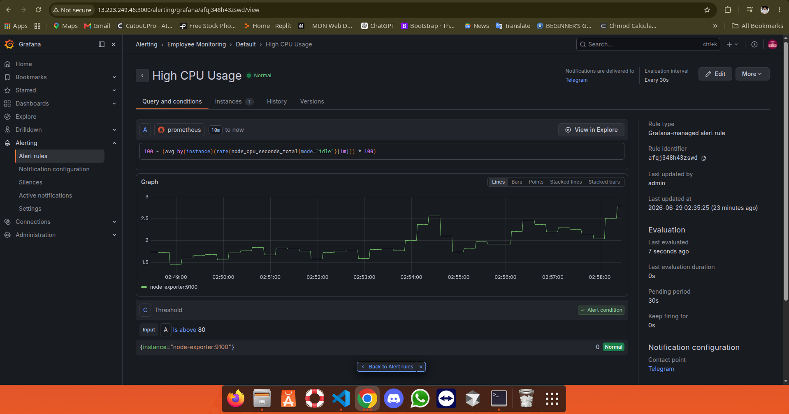
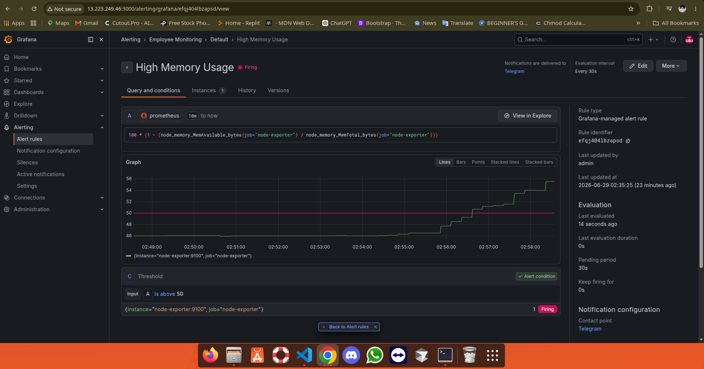
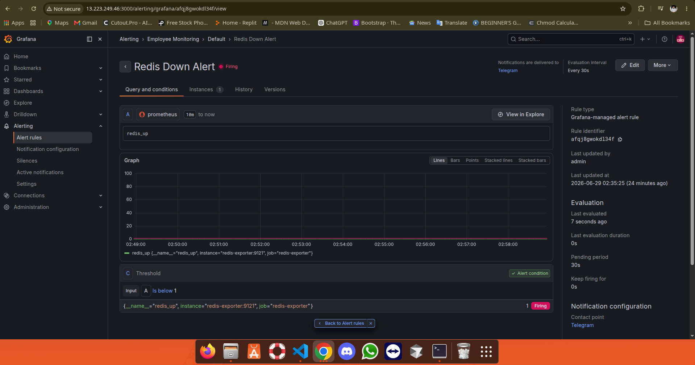
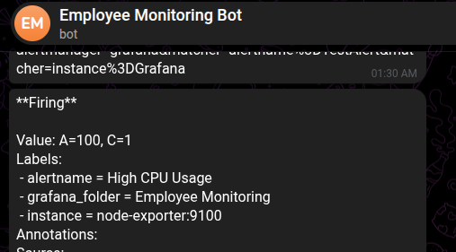
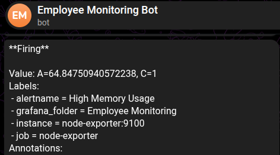

# Employee Portal DevOps

A production-ready Employee Management System built using Flask, PostgreSQL, Redis, Docker, Prometheus, Grafana, and Telegram Alerting. The project demonstrates containerized application deployment, infrastructure monitoring, application monitoring, health checks, and real-time alerting on AWS EC2.

---

# Project Overview

Employee Portal DevOps is a complete DevOps implementation of an employee management application.

The project focuses on deploying a production-ready backend using Docker and Docker Compose, monitoring both infrastructure and application metrics using Prometheus and Grafana, and sending automated Telegram notifications whenever critical incidents occur.

The objective of this project is to demonstrate real-world DevOps practices such as monitoring, observability, alerting, containerization, service health checks, and cloud deployment.

---

# Key Features

* Employee Management REST API
* Flask Backend
* PostgreSQL Database
* Redis Caching
* Docker Containerization
* Docker Compose Orchestration
* Gunicorn Production Server
* Prometheus Monitoring
* Grafana Dashboards
* Node Exporter
* PostgreSQL Exporter
* Redis Exporter
* Application Metrics
* Docker Health Checks
* Telegram Alert Notifications
* AWS EC2 Deployment

---

# Technology Stack

## Backend

* Python
* Flask
* Gunicorn

## Database

* PostgreSQL
* Redis

## Monitoring

* Prometheus
* Grafana
* Node Exporter
* PostgreSQL Exporter
* Redis Exporter

## DevOps

* Docker
* Docker Compose
* Linux
* AWS EC2
* Git
* GitHub

---

# Monitoring

The monitoring stack collects infrastructure as well as application metrics.

## Infrastructure Monitoring

* CPU Usage
* Memory Usage
* Disk Usage
* Disk I/O
* Network Receive
* Network Transmit
* System Load Average

## Application Monitoring

* HTTP Request Count
* HTTP Response Time
* Backend Health Status
* Employee API Requests
* Database Availability
* Redis Availability

---

# Alerting

The following alert rules are configured inside Grafana.

| Alert                 | Description                                                 |
| --------------------- | ----------------------------------------------------------- |
| High CPU Usage        | Triggers when CPU usage exceeds the configured threshold    |
| High Memory Usage     | Triggers when memory usage exceeds the configured threshold |
| Employee Backend Down | Triggers when backend service becomes unavailable           |
| PostgreSQL Down       | Triggers when PostgreSQL becomes unavailable                |
| Redis Down            | Triggers when Redis becomes unavailable                     |

Every alert automatically sends a notification to Telegram.

---

# Project Structure

```text
employee-portal-devops/
│
├── backend/
├── prometheus/
├── grafana/
├── screenshots/
├── docker-compose.yml
├── requirements.txt
├── README.md
└── .env.example
```

---

# Screenshots

## Employee Portal Homepage



---

## Prometheus Targets



---

## Grafana Overview Dashboard


---

## System Monitoring Dashboard



---

## Advanced Monitoring Dashboard


---

## High CPU Alert



---

## Backend Down Alert


---

## High Memory Alert



---

## PostgreSQL Down Alert


---

## Redis Down Alert



---

## Telegram High CPU Notification



---

## Telegram High Memory Notification



---

## Telegram PostgreSQL Notification


---

## Telegram Redis Notification


---

# Deployment

Clone the repository.

```bash
git clone https://github.com/your-username/employee-portal-devops.git
```

Move into the project directory.

```bash
cd employee-portal-devops
```

Build and start all containers.

```bash
docker compose up -d --build
```

---

# Services

| Service             | Port |
| ------------------- | ---- |
| Employee Backend    | 5001 |
| PostgreSQL          | 5432 |
| Redis               | 6379 |
| Prometheus          | 9090 |
| Grafana             | 3000 |
| Node Exporter       | 9100 |
| PostgreSQL Exporter | 9187 |
| Redis Exporter      | 9121 |

---

# Monitoring Components

* Prometheus
* Grafana
* Node Exporter
* PostgreSQL Exporter
* Redis Exporter
* Flask Metrics Endpoint
* Docker Health Check

---

# Future Enhancements

* Jenkins CI/CD Pipeline
* GitHub Actions
* Kubernetes Deployment
* Helm Charts
* Loki Integration
* Promtail Integration
* Nginx Reverse Proxy
* SSL using Let's Encrypt
* Custom Domain
* Auto Scaling
* Centralized Logging

---

# Author

**Sachin Choudhary**

Bachelor of Technology (Computer Science Engineering – Artificial Intelligence)

### Skills

* Python
* Flask
* Docker
* Docker Compose
* PostgreSQL
* Redis
* Prometheus
* Grafana
* AWS EC2
* Linux
* Git
* GitHub

---

# License

This project is created for educational purposes and to demonstrate practical DevOps implementation using Docker, Prometheus, Grafana, and AWS.

